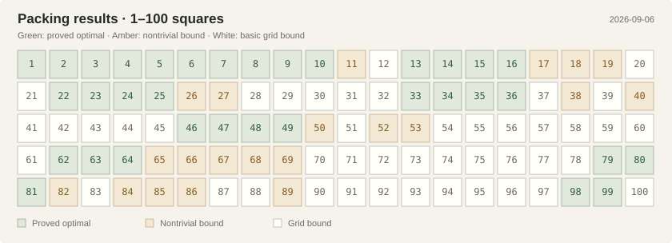

# Square Packing Archive

[](https://github.com/chelokot/square-packing-archive/actions/workflows/ci.yml)
[](formal/lean-toolchain)
[](LICENSE)
[](LICENSE-DATA)

How small a square can contain `n` unit squares? Squares may rotate, but their
interiors cannot overlap. Browse the packings, historical results, and proofs.

**[Open the interactive archive →](https://chelokot.github.io/square-packing-archive/)**

[](https://chelokot.github.io/square-packing-archive/#explore)

**Verified means checked by Lean—not necessarily proved optimal.** An exact
result (`=`) proves optimality; an upper bound (`≤`) proves a packing exists.
Published proofs awaiting Lean keep a separate label. Each record links to its
authors, sources, and available formal proofs.

Counts without catalogued records show a **basic grid bound**, `s(n) ≤ ⌈√n⌉`,
with a Lean proof and viewable coordinates. These derived bounds are not
historical records and do not contribute to the record or exact-result counts.

## What is live

- A versioned canonical manifest with claims, authors, sources, provenance, and
  immutable record lineage.
- Curated historical exact results below 100 and selected historical upper-bound
  progressions.
- Lean-verified exact rational certificates for the archive's new upper bounds
  `s(68) ≤ 8.80339` and `s(69) ≤ 8.8272`.
- A Lean geometry model, a formal area theorem, a proof that `s(m²) = m` for
  every `m`, and a rational separating-axis certificate checker with a proved
  soundness theorem.
- Exact finite-point proofs, a shared staggered-lattice theorem, and a
  continuous-motion preservation theorem; see the
  [Friedman](docs/friedman-unavoidable-formalization.md),
  [Bentz lattice](docs/bentz-lattice-formalization.md), and
  [moving-configuration](docs/bentz-moving-unavoidable-formalization.md) notes.
  Exact results for 6, 10, 13, 22, and 33 are also fully checked; see the
  [proof notes](docs/small-records-formalization.md), including
  [corrections to Bentz's auxiliary sets for 13](docs/bentz-13-formalization.md).
- A generated dashboard with a proof matrix, historical coverage graph, record
  timelines, source links, and an interactive packing viewer.
- Viewer controls for zoom, pan, view rotation, square inspection, exact
  coordinates, and filtering by orientation group.
- A shared `?n=` selection across the matrix, viewer, and record history;
  searchable evidence and author filters; accessible square inspection.
- Separate publication and Lean check dates. Historical coverage uses the
  date each proof was recorded as checked, rather than its publication year.

The historical catalog is intentionally incomplete at the first release. Missing
records are visible as missing; import work never invents metadata or silently
upgrades evidence.

## Architecture

```text
archive/
  manifest.json                 canonical metadata and record lineage
  configurations/              exact rational packing certificates
apps/web/                       generated React dashboard and SVG viewer
packages/domain/                schema, validation, and pure derived views
formal/SquarePackingArchive/    definitions, sound checker, and Lean theorems
scripts/                        deterministic import and code generation
```

`archive/manifest.json` and its referenced configuration files are the only
editable source of archive facts. The web bundle and README matrix are generated
from them with `bun run archive:build`; `bun run archive:check` rejects a stale
README matrix. Both views use the same claim-selection rules. Lean
record modules are also generated from the same rational configurations, while
their shared soundness proof is maintained by hand.

## Trust model

| Display status              | Meaning                                                    |
| --------------------------- | ---------------------------------------------------------- |
| `Reported`                  | A tracker or source reports the claim.                     |
| `Computed · awaiting Lean`  | An independent computational certificate exists.           |
| `Published · awaiting Lean` | A mathematical proof is published but not formalized here. |
| `Lean verified`             | Lean CI checks the exact theorem without `sorry`.          |

Only the final row contributes to verified counters and graphs.

## Development

Install [Bun](https://bun.sh/) and [elan](https://github.com/leanprover/elan),
then run:

```console
bun install
bun run archive:build
bun run check
bun run test
bun run build

cd formal
lake update
lake exe cache get
lake build
```

The [public site](https://chelokot.github.io/square-packing-archive/) is deployed
to GitHub Pages by [the Pages workflow](.github/workflows/pages.yml) on pushes
to `main`.

The web application runs locally with:

```console
bun run dev
```

The optional private Sites preview uses the same app, built at the origin root:

```console
bun run site:package
```

This produces `dist/site.tar.gz` containing only the built static site and its
Sites deployment metadata. The normal build retains the GitHub Pages base path.
The static packaging script follows the Sites archive contract; the bundled
Worker-only packaging helper and Sites Vite plugin are not used by this app.

The social-preview artwork at `apps/web/public/og.png` was generated with the
built-in imagegen tool using the prompt recorded in [the artwork notes](docs/site-artwork.md).

## Reproducible imports

Grid packings and the 5- and 10-square Göbel constructions are generated from
recipes in the manifest. Exact coordinates, including square-root expressions,
can be inspected and downloaded in the viewer. Every build checks containment
and non-overlap using exact arithmetic; this is separate from Lean verification
of the bound or optimality claim.

The archive's two initial computational records are imported from the companion
research workspace and reconstructed with exact rational orientations:

```console
python scripts/import-research-records.py \
  ../square-packing-research/records/square-68.json \
  archive/configurations/square-68.json

python scripts/generate-lean-certificates.py \
  archive/configurations/square-68.json \
  formal/SquarePackingArchive/Records/Square68.lean
```

The importer replaces every floating angle with a rational tangent-half-angle.
Consequently, `sin θ`, `cos θ`, containment, and all separating axes are exact
rational expressions inside Lean.

## Sources and gratitude

The initial historical catalog is grounded in
[Erich Friedman's survey](https://doi.org/10.37236/28) and the current
[Squares in Squares tracker](https://kingbird.myphotos.cc/packing/squares_in_squares.html),
whose high-precision SVG work is maintained by David Ellsworth. The archive is
not a replacement for either: it is the formal, structured layer their work
makes possible. Every individual result retains discoverer, optimizer, prover,
date, and source roles where available.

See [ATTRIBUTION.md](ATTRIBUTION.md) and [CONTRIBUTING.md](CONTRIBUTING.md).
Source-specific proof limitations and corrections are recorded in
[the Nagamochi 2005 notes](docs/nagamochi-2005-formalization.md). In particular,
Lean checks a [counterexample to the universal resource-score premise](docs/nagamochi-score-counterexample.md);
the packing result nevertheless holds: Lean now proves `s(n²−2)=n` for every
integer `n ≥ 2`, using [a replacement compensation argument](docs/nagamochi-compensation-proof.md)
and separate proofs for the small cases. The false lemma is not assumed.
The reusable
finite-piercing reduction and its current geometric coverage are tracked in
[the Friedman unavoidable-point notes](docs/friedman-unavoidable-formalization.md).

## License

Code, generators, the web application, and Lean sources are available under
Apache-2.0. Canonical metadata, original prose, and original generated
visualizations are available under CC BY 4.0. Linked publications and external
sites remain under their own terms.
