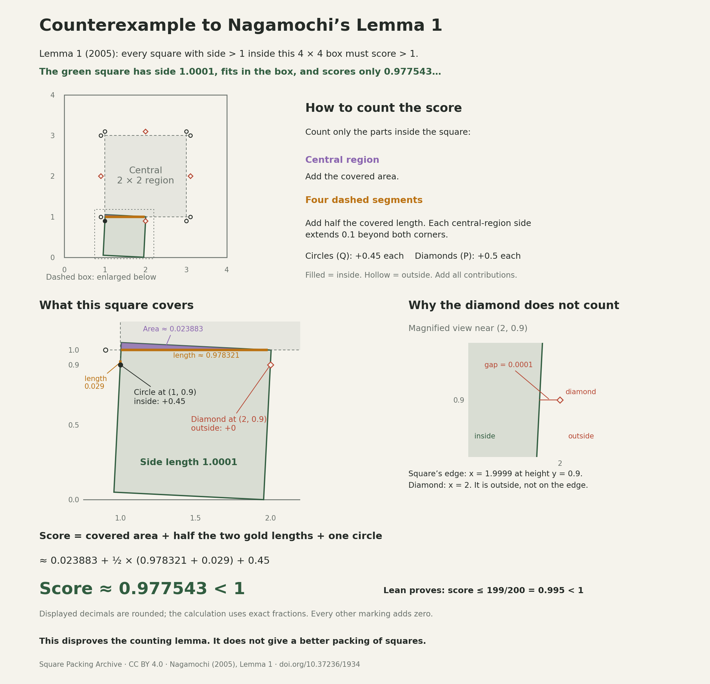

# Counterexample to Nagamochi’s Lemma 1

The green square below has side length **1.0001** and fits entirely inside a
**4×4 container**. Nagamochi’s Lemma 1 says that any square with side length
greater than 1 in this container must collect **more than 1** under the
counting rule below. This square collects **0.977543…**.

This is a counterexample to the lemma in
[Hiroshi Nagamochi’s _Packing Unit Squares in a Rectangle_ (2005)](https://www.combinatorics.org/ojs/index.php/eljc/article/download/v12i1r37/pdf).
It does **not** show that more squares can be packed into a smaller container.

## What is being counted?

Draw these fixed markings inside the 4×4 container. A square’s **score** is the
sum of the following contributions—not its area or perimeter. Contributions
are counted in the square’s interior.

| Fixed marking                                                             | What counts toward the score            |
| ------------------------------------------------------------------------- | --------------------------------------- |
| The central 2×2 region, from `(1,1)` to `(3,3)`                           | The area covered by the square          |
| The four sides of that region, each extended by 0.1 at both ends          | Half the total length inside the square |
| A circle at each of the eight segment endpoints (called `Q` in the paper) | 0.45 for each point inside the square   |
| Four diamonds at `(2,0.9)`, `(2,3.1)`, `(0.9,2)`, `(3.1,2)` (called `P`)  | 0.5 for each point inside the square    |

These are the rules from Section 3 of the paper, after its change of scale:
instead of unit squares in a smaller container, consider squares with side
length greater than 1 in the 4×4 container. Rotation is allowed.

[](assets/nagamochi-counterexample.svg)

[Open the vector diagram](assets/nagamochi-counterexample.svg) ·
[Download the PNG](assets/nagamochi-counterexample.png)

A filled circle is inside the square; hollow markers are outside. Purple shows
the counted area and gold shows the counted line lengths. Each drawing uses
equal horizontal and vertical scales; the two close-ups are magnified.

## Why the lemma matters

The markings have a total score of **14**: area `4`, line lengths worth `4.4`,
circles worth `3.6`, and diamonds worth `2`. Squares with disjoint interiors
cannot count the same area, length or point twice. If every square with side
length greater than 1 collected **more than 1**, then 14 such squares could not
fit. Scaling back would rule out 14 unit squares in any container smaller than
4×4.

The counterexample breaks the claim about **each individual square**. It does
not provide a packing of 14 squares. In particular, it does not disprove
`s(n²−2)=n`: the claim that the smallest container for `n²−2` unit squares has
side length `n`.

## Add up this square’s score

Only one marked point, the circle at `(1,0.9)`, is inside the square. The diamond
at `(2,0.9)` is outside: at height `0.9`, the square’s right edge is at
`x=1.9999`, leaving a horizontal gap of `0.0001`. No marked point lies exactly
on the square’s boundary.

| Counted part                          | Contribution to the score       | Approximate value |
| ------------------------------------- | ------------------------------- | ----------------- |
| Purple area inside the central region | `611022059041 / 25584000000000` | `0.023883`        |
| Half the gold horizontal length       | `1251468079 / 2558400000`       | `0.489160`        |
| Half the gold vertical length         | `29/2000`                       | `0.0145`          |
| The circle at `(1,0.9)`               | `9/20`                          | `0.45`            |
| Everything else                       | `0`                             | `0`               |

Adding the exact fractions gives

```text
score = 25009470849041 / 25584000000000
      = 0.977543419677962789… < 1.
```

## Exact coordinates

The container is `[0,4]²`. Here `λ` is the side length, `c` and `s` are the
cosine and sine of the rotation angle, and `A` is the bottom vertex:

```text
λ = 10001/10000
c = 80/1601
s = 1599/1601
A = (10419467/5330000, 0).
```

Since `c²+s²=1`, these four vertices form a square of side `λ`:

```text
A
A + λ(c, s)
A + λ(c−s, s+c)
A + λ(−s, c).
```

The whole square, including its boundary, fits inside `[0,4]²`.

## Check it

[The Python checker](../scripts/check-nagamochi-counterexample.py) computes that
exact score using rational arithmetic. It also generates the diagram from the
same coordinates.

```console
python3 scripts/check-nagamochi-counterexample.py --check-figure
```

To regenerate the SVG and PNG, install `matplotlib` and run the checker with
`--figure`. Drawing uses rounded coordinates; every mathematical check uses
exact fractions.

[The Lean proof](../formal/SquarePackingArchive/NagamochiCounterexample.lean)
checks that this square fits in `[0,4]²`. It also checks the equivalent
unit square in a container of side `4/λ`. Lean proves an upper bound on the
score, not the exact fraction above:

```text
score ≤ 3/100 + (1/2)(1 + 3/100) + 9/20
      = 199/200 = 0.995 < 1.
```

The final theorem is `SquarePackingArchive.Nagamochi.not_scoresDilatedSquares_four`.
Its only axioms are Lean’s standard `propext`, `Classical.choice`, and
`Quot.sound`. Python calculates the exact score; Lean independently proves
that it is below one.

## Where the argument fails

In Case 6, the paper moves a square until `(2,0.9)` touches an edge, then
applies Lemma 6. But Lemma 6 requires **that edge to cross `y=1`**.

Shift the square right by `1/10000`. Then `(2,0.9)` touches the edge from the
bottom vertex to the right vertex. That edge ends at height `λ·1599/1601 < 1`.
It does not cross `y=1`, so Lemma 6 does not apply.

The general packing theorem needs a repaired argument or a different proof.
The individual packing results already checked in Lean have separate proofs;
this counterexample does not affect them.
